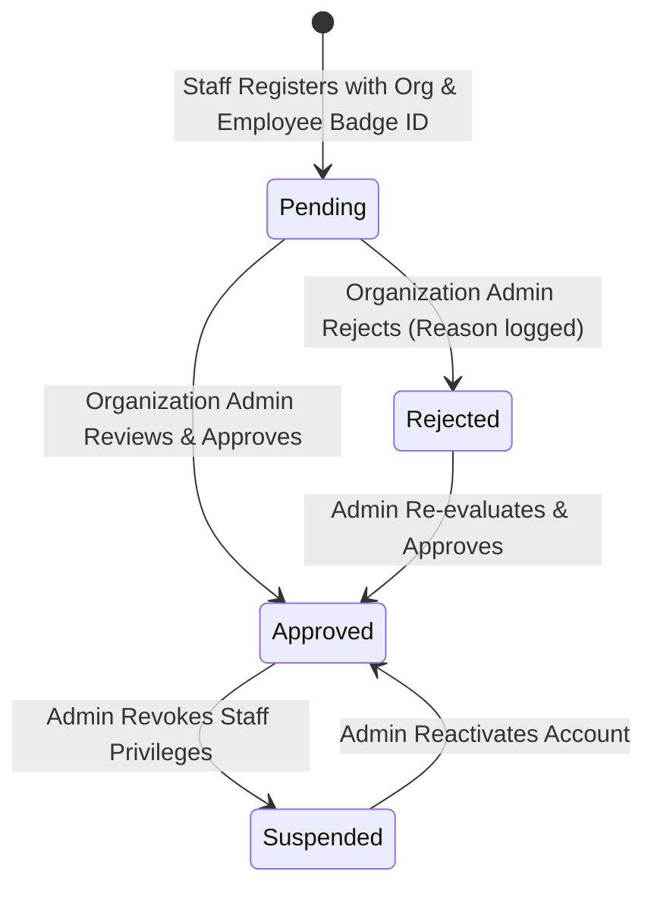
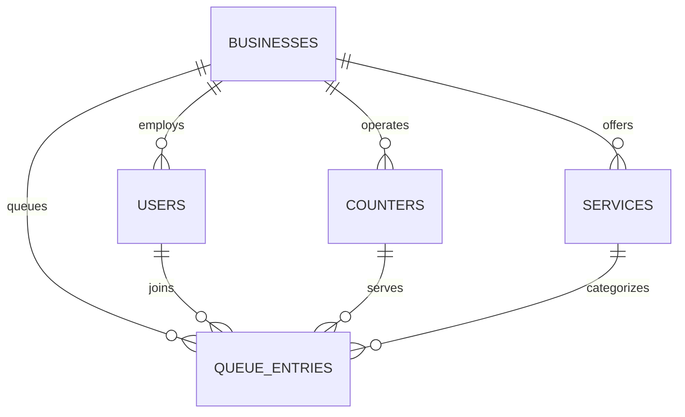

# ⏱️ WaitWise — Real-Time Smart Virtual Queue Platform

> **"Know when to go instead of waiting in line."**  
> An enterprise-grade, real-time virtual queue management system built with **React, TypeScript, Node.js, Express, Socket.IO, and SQLite** to eliminate physical waiting lines in hospitals, clinics, DMV offices, salons, restaurants, and service centers.

---

## 📑 Table of Contents
- [Problem & Solution](#-problem--solution)
- [Key Features](#-key-features)
- [System Architecture](#-system-architecture)
- [Role-Based Access Control & Staff Verification](#-role-based-access-control--staff-verification)
- [Dynamic ETA & Anomaly Detection](#-dynamic-eta--anomaly-detection)
- [Technology Stack](#-technology-stack)
- [Database Design](#-database-design)
- [Getting Started](#-getting-started)
- [Demo Accounts & Test Scenarios](#-demo-accounts--test-scenarios)
- [Automated Verification Suite](#-automated-verification-suite)
- [Documentation Index](#-documentation-index)

---

## 🎯 Problem & Solution

### The Problem
Physical waiting rooms waste billions of human hours annually. Overcrowded waiting halls cause stress, increase airborne viral transmission risks in medical facilities, skew staffing efficiency, and lead to high customer churn from unpredictable delays.

### The Solution
WaitWise replaces physical queues with a **Dynamic Virtual Queue System**:
1. **Remote Check-In**: Customers discover nearby participating places and join virtual queues from their phones.
2. **Live Ticket Tracker**: Mobile-first digital ticket displaying live position countdowns, dynamic ETAs, and QR check-in codes.
3. **Turn Alerting**: Audio and visual chimes notify patrons when their token is called to a specific counter.
4. **Staff Command Center**: Counter operators manage line progression with 1-click calls, status updates, and reception desk walk-in ticketing.
5. **Admin Staff Verification**: An organization verification pipeline ensuring only authorized personnel access counter operations.

---

## ✨ Key Features

### 👤 Customer Experience
- **Facility Discovery**: Search hospitals, clinics, DMV offices, salons, and banks by category or city.
- **Instant Virtual Join**: Select desired service and join the queue in one tap.
- **Real-Time Ticket Tracker**: Live position updates, estimated wait time countdown, and counter directions.
- **Audio Chimes**: Web Audio API dual-tone chimes alert users when called.
- **Customer Dashboard**: View active queue passes and complete queue history.

### 🛡️ Staff Counter Management
- **Counter Station Stationing**: Toggle active counters and station operators.
- **1-Click Call Next**: Call the next waiting patron with automatic live broadcasting.
- **Ticket Lifecycle Management**: Mark tickets as *Serving*, *Completed*, *Skipped*, or *Re-queued*.
- **Reception Desk Walk-Ins**: Issue prioritized tickets for visitors arriving in person.
- **Facility Controls**: Pause or resume queue intake with immediate client sync.

### 🏢 Superadmin & Organization Verification
- **Staff Onboarding Requests**: Review staff registrations across all participating facilities.
- **Credential Authorization**: Approve, reject (with reason), suspend, or reactivate staff accounts.
- **Multi-Tenant Isolation**: Enforce tenant boundaries so staff only access their assigned facility.

---

## 🏗️ System Architecture

```mermaid
graph TD
    Client["React + Vite Single-Page Application (SPA)"]
    API["Express.js REST API Layer"]
    SocketServer["Socket.IO Real-Time Server"]
    QueueEngine["In-Memory & SQLite Queue Engine"]
    DB[("Embedded SQLite Engine (node:sqlite)")]

    Client -->|HTTP / JSON REST| API
    Client <-->|WebSockets (Rooms & Broadcasts)| SocketServer
    API --> QueueEngine
    QueueEngine --> DB
    QueueEngine --> SocketServer
```

---

## 🔐 Role-Based Access Control & Staff Verification

Staff privileges require **explicit organization authorization** to prevent unauthorized users from viewing confidential queue data or modifying counter states.



### Multi-Tenant Isolation Rule
Staff members are strictly restricted to their assigned facility (`req.user.business_id === targetBusinessId`). Attempting cross-facility operations returns `HTTP 403 Forbidden`.

---

## ⏱️ Dynamic ETA & Anomaly Detection

WaitWise calculates waiting times dynamically:

$$\text{Base Wait Time} = \frac{(P - 1) \times \bar{T}_{\text{rolling}}}{C_{\text{active}}}$$

- $P$: Zero-indexed queue position.
- $\bar{T}_{\text{rolling}}$: Rolling average service duration of the last 10 completed tickets.
- $C_{\text{active}}$: Count of active operating counters ($\ge 1$).
- **Bottleneck Detection**: If waiting duration exceeds $1.5 \times \text{Initial ETA}$, an alert is flagged on the staff dashboard.

---

## 💻 Technology Stack

| Layer | Technology | Rationale |
| :--- | :--- | :--- |
| **Frontend** | React 18, TypeScript, Vite | Fast HMR, type safety, modular component architecture |
| **Styling** | TailwindCSS, Lucide Icons | Responsive, accessible UI tokens and status badges |
| **Routing** | Wouter | Lightweight client-side routing |
| **Backend** | Node.js v24 (ESM), Express.js | High-throughput asynchronous REST endpoints |
| **Real-Time** | Socket.IO v4 | Low-latency room-based WebSocket broadcasts |
| **Database** | Embedded SQLite (`node:sqlite`) | Zero-dependency, persistent ACID storage with sub-millisecond queries |
| **Security** | JWT, Bcrypt.js, Zod | Cryptographic sessions, 10 salt rounds password hashing, schema validation |

---

## 🗄️ Database Design



---

## 🚀 Getting Started

### Prerequisites
- **Node.js**: v20+ or v24+ (v24 recommended for native `node:sqlite`)
- **npm**: v10+

### Installation
```bash
# 1. Clone the repository
git clone https://github.com/your-username/waitwise.git
cd waitwise

# 2. Install all dependencies for root, server, and client
npm run install:all

# 3. Seed database with pre-configured facilities and staff accounts
npm run seed

# 4. Start full-stack development environment (Server + Client)
npm run dev
```

The application will be available at:
- **Frontend Client**: `http://localhost:5173`
- **Backend API**: `http://localhost:5000/api`

---

## 👥 Demo Accounts & Test Scenarios

All demo accounts use password: `password123`

| Role | Account Email | Facility | Status / Purpose |
| :--- | :--- | :--- | :--- |
| **Admin** | `admin@waitwise.com` | System Superadmin | Staff verification & platform management |
| **Staff (Hospital)** | `metro.staff@waitwise.com` | Metro Care General Hospital | Approved counter operator |
| **Staff (DMV)** | `dmv.staff@waitwise.com` | Civic DMV & Licensing | Approved counter operator |
| **Staff (Salon)** | `salon.staff@waitwise.com` | Radiant Glow Salon | Approved counter operator |
| **Staff (Dental)** | `apex.staff@waitwise.com` | Apex Dental Care | Approved counter operator |
| **Pending Staff** | `pending.staff@waitwise.com` | Metro Care General Hospital | Test pending verification login denial |
| **Rejected Staff** | `rejected.staff@waitwise.com` | Civic DMV | Test rejection feedback screen |
| **Suspended Staff** | `suspended.staff@waitwise.com` | Radiant Glow Salon | Test suspended account lockout |
| **Customer** | `user@waitwise.com` | N/A | Virtual queue pass holder |

---

## 🧪 Automated Verification Suite

WaitWise comes with an automated security, RBAC, and multi-tenant test runner:

```bash
npm test
```

### Verified Test Cases:
- Customer registration & duplicate email rejection.
- Customer RBAC isolation (403 on staff endpoints).
- Staff onboarding (`pending` verification lifecycle).
- Superadmin authorization & verification workflow.
- Approved staff walk-in creation.
- Multi-tenant cross-organization isolation guards.
- Account suspension and immediate access revocation.

---

## 📚 Documentation Index

Detailed architectural and operational documentation is available in the [`docs/`](./docs) directory:

- [System Architecture](./docs/architecture.md)
- [Authentication Workflow](./docs/authentication.md)
- [Authorization & RBAC](./docs/authorization.md)
- [Database Schema & ERD](./docs/database.md)
- [REST API Reference](./docs/api.md)
- [Real-Time WebSocket Architecture](./docs/realtime.md)
- [Dynamic ETA & Queue Engine](./docs/queue-engine.md)
- [Product Strategy & User Journeys](./docs/product.md)
- [Portfolio & Resume Brief](./docs/portfolio.md)
- [Testing & Quality Assurance Guide](./docs/testing.md)
- [Future Roadmap](./docs/roadmap.md)

---

## 📄 License
This project is licensed under the MIT License — see the [LICENSE](LICENSE) file for details.
