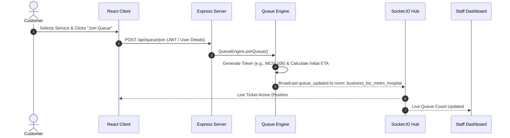
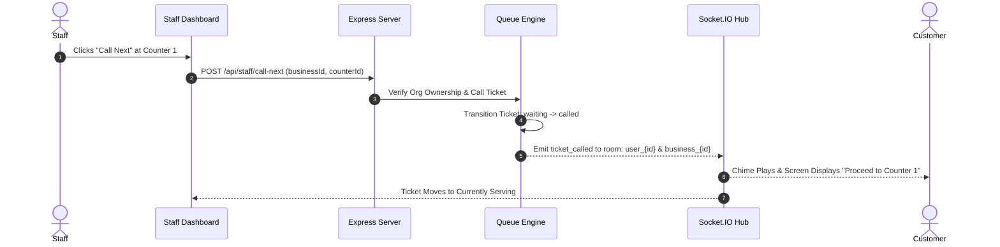

# WaitWise System Architecture

## Overview
WaitWise is a full-stack, real-time virtual queue management system built to eliminate physical waiting lines in high-traffic facilities such as hospitals, clinics, salons, government agencies, and service centers.

```mermaid
graph TD
    Client["React + Vite Single-Page Application (SPA)"]
    API["Express.js REST API Layer"]
    SocketServer["Socket.IO Real-Time Server"]
    QueueEngine["In-Memory & SQLite Queue Engine"]
    DB[("Embedded SQLite Engine (node:sqlite)")]

    Client -->|HTTP / JSON REST| API
    Client <-->|WebSockets (Rooms & Broadcasts)| SocketServer
    API --> QueueEngine
    QueueEngine --> DB
    QueueEngine --> SocketServer
```

---

## High-Level Component Topology

### 1. Presentation Layer (`client/`)
- **Framework**: React 18 with TypeScript and Vite.
- **Routing**: `wouter` for lightweight declarative client-side navigation.
- **Styling**: TailwindCSS with accessible color palettes, dynamic status badges, and fluid layout cards.
- **State Management & Contexts**:
  - `AuthContext`: Manages JWT tokens, user profiles, session hydration, and role capabilities (`isCustomer`, `isStaff`, `isAdmin`).
  - `SocketContext`: Maintains the singleton WebSocket connection and handles room subscriptions (`business_{id}`, `user_{id}`).
  - `NotificationContext`: Manages unread counter, audio alerts via Web Audio API, and persistent notification tray.

### 2. Application Layer (`server/`)
- **Runtime**: Node.js v24 (ESM modules).
- **Web Framework**: Express 4 with modular route controllers and Zod schema validation.
- **Real-Time Engine**: Socket.IO v4 supporting pub/sub room isolation.
- **Data Persistence**: Native Node 24 embedded `node:sqlite` (`DatabaseSync`), guaranteeing zero external database dependencies, sub-millisecond local queries, and ACID transactional integrity.

---

## Data Flow & Lifecycle

### Customer Virtual Queue Flow


### Staff Turn Calling & Serving Flow


---

## Multi-Tenant Security & Isolation
- **Organization Scoping**: Every business operates under its unique `id` (e.g. `biz_metro_hospital`, `biz_civic_dmv`).
- **Staff Binding**: Staff users have an immutable `business_id` in SQLite.
- **Backend Guard**: All mutation routes enforce `checkBusinessAuthorization(req, businessId)`. Cross-organization tampering produces an immediate `403 Forbidden`.
