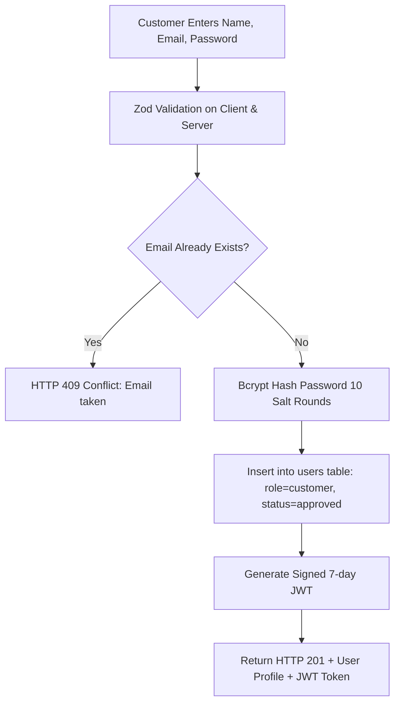
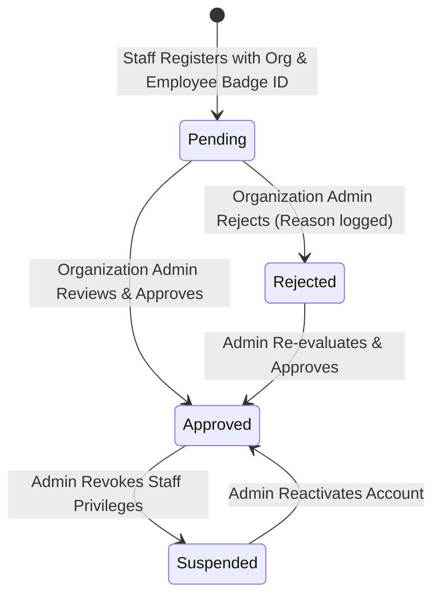

# Authentication Architecture & Workflows

## Overview
WaitWise enforces a strict distinction between **Public / Customer Authentication** and **Staff Organization Onboarding**.

---

## 1. Customer Authentication Flow

Customers can register freely to access their dashboard, track personal ticket histories, join queues, and receive turn notifications.



---

## 2. Staff Onboarding & Organization Verification Flow

Unlike customer accounts, staff privileges require **explicit organization authorization** to prevent unauthorized users from viewing confidential queue data or modifying counter states.



### Step 1: Staff Registration (`/staff/register`)
- **Required Fields**: Full Name, Work Email, Phone, Organization (`business_id`), Functional Role / Job Title, Employee / Staff Badge ID, Password.
- **Initial State**: Account is stored with `role: 'staff'`, `status: 'pending'`.
- **Access Level**: No JWT is issued upon submission; the applicant is directed to a status screen.

### Step 2: Login Status Verification (`POST /api/auth/login`)
When any user logs in, the backend evaluates credentials and account state:

| Role | Status | Backend Behavior | HTTP Code |
| :--- | :--- | :--- | :--- |
| `customer` | `approved` | Issues JWT token, redirects to Customer Dashboard | `200 OK` |
| `admin` | `approved` | Issues JWT token, redirects to Admin Verification Portal | `200 OK` |
| `staff` | `approved` | Issues JWT token with `role: 'staff'`, redirects to Staff Dashboard | `200 OK` |
| `staff` | `pending` | Denies login with message: *"Your staff account is awaiting organization verification."* | `403 Forbidden` |
| `staff` | `rejected` | Denies login with message: *"Staff verification was rejected: [Reason]"* | `403 Forbidden` |
| `staff` | `suspended` | Denies login with message: *"Staff account has been suspended."* | `403 Forbidden` |

---

## 3. JWT Token Structure & Storage

Tokens are signed using `jsonwebtoken` with HMAC SHA-256:

```json
{
  "id": "usr_staff_hospital",
  "email": "metro.staff@waitwise.com",
  "name": "Nurse Sarah Jenkins",
  "role": "staff",
  "status": "approved",
  "business_id": "biz_metro_hospital",
  "iat": 1770984000,
  "exp": 1771588800
}
```

### Authoritative Database Synchronization
To prevent stale token exploits, the `authenticateToken` middleware verifies the cryptographic signature **and** performs an authoritative lookup in the SQLite `users` table. If an administrator suspends or revokes a staff account, all subsequent API calls from that token are immediately denied.
