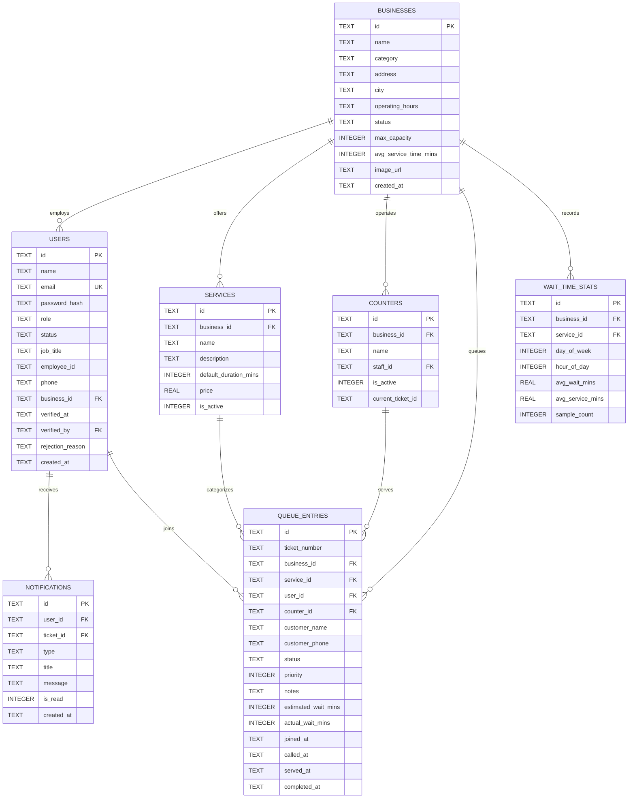

# Database Design & Schema Specifications

## Overview
WaitWise utilizes an embedded **SQLite engine** powered by Node.js v24's native `node:sqlite` (`DatabaseSync`).

### Key Benefits:
- **Zero Cloud / Third-Party Dependencies**: No PostgreSQL, Supabase, or Firebase required.
- **Persistent Local Storage**: Persisted in `server/data/waitwise.db`.
- **Sub-Millisecond Query Latency**: Synchronous in-process execution eliminates network round-trips.
- **ACID Compliance**: Full transaction support with strict foreign key constraints.

---

## Entity Relationship Diagram (ERD)

---

## Indexing Strategy

| Index Name | Table | Columns | Purpose |
| :--- | :--- | :--- | :--- |
| `idx_users_role_status` | `users` | `(role, status)` | Fast filtration for admin verification workflows |
| `idx_users_business` | `users` | `(business_id)` | Efficient staff lookups by organization |
| `idx_queue_business_status` | `queue_entries` | `(business_id, status)` | High-speed active queue calculations & token retrieval |
| `idx_queue_user` | `queue_entries` | `(user_id)` | Fast lookup for customer active and historical tickets |
| `idx_stats_lookup` | `wait_time_stats` | `(business_id, day_of_week, hour_of_day)` | Instant retrieval of historical hourly waiting profiles |
