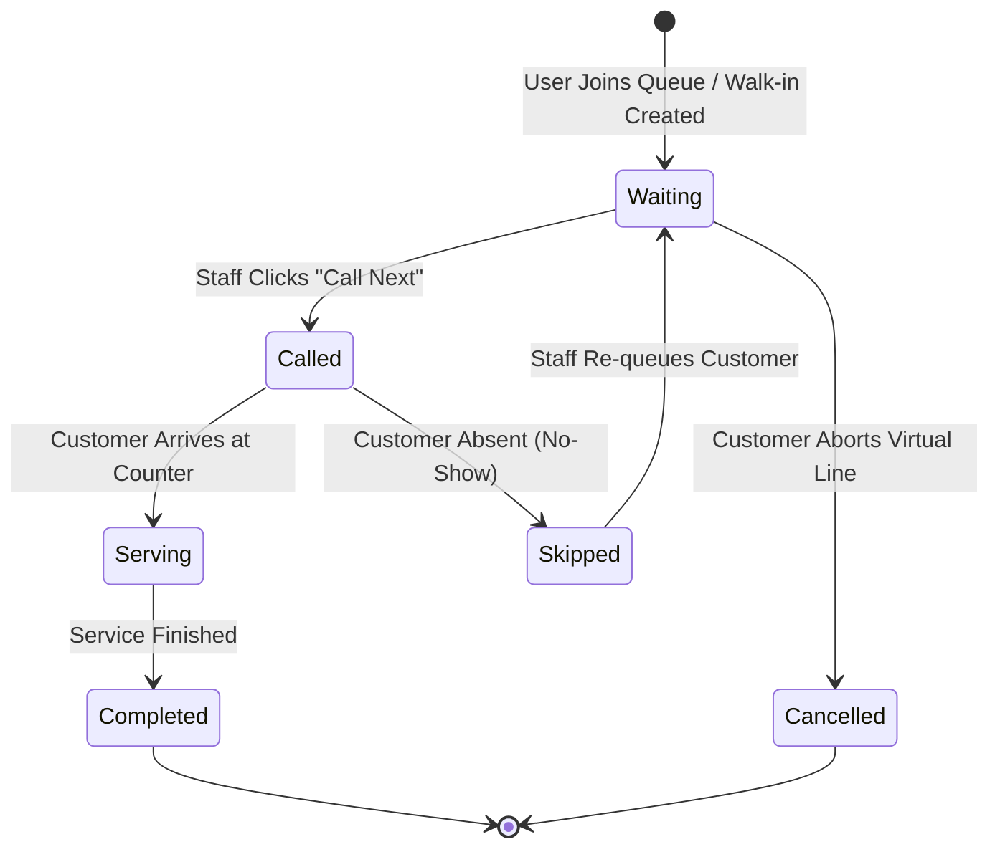

# Dynamic ETA Engine & Queue State Machine

## Overview
Unlike naive FIFO queues that display static approximations, WaitWise calculates **Dynamic Estimated Waiting Times** based on:
1. Active operating counter capacity.
2. Rolling service completion speed over the last 10 served tickets.
3. Service category duration weight multipliers.
4. Historical hourly averages by day-of-week and time-of-day.
5. Priority customer weighting.

---

## Mathematical Formulation

For any ticket at position $P$ with priority weight $W_s$ and active counters $C$:

$$\text{Base Wait Time} = \frac{(P - 1) \times \bar{T}_{\text{rolling}}}{C_{\text{active}}}$$

Where:
- $P$ is the zero-indexed position in the queue.
- $\bar{T}_{\text{rolling}}$ is the weighted average service time of the last $N$ completions.
- $C_{\text{active}}$ is the count of currently open counters ($\ge 1$).

### Anomaly & Delay Detection
If a customer has been in the `waiting` state longer than $1.5 \times \text{Initial ETA}$, the system flags `is_excessive_wait: true`, notifying staff of a potential bottleneck.

---

## Queue Entry State Machine

---

## Token Sequence Formatting

Tokens are generated with facility-specific prefixes:
- **Metro Care General Hospital**: `MCG-101`, `MCG-102`...
- **Civic DMV & Licensing**: `DMV-201`, `DMV-202`...
- **Radiant Glow Salon**: `RGS-301`, `RGS-302`...
- **Apex Dental Care**: `ADC-401`, `ADC-402`...
- **Urban Tech Care**: `UTC-501`, `UTC-502`...
- **Metro Community Bank**: `MCB-601`, `MCB-602`...
