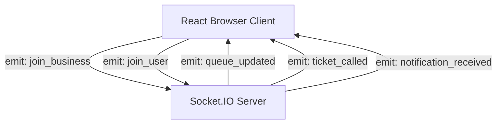

# Real-Time Event Architecture (Socket.IO)

## Overview
WaitWise leverages **Socket.IO v4** over WebSockets with room-based broadcast isolation.

---

## 1. Room Architecture & Subscription Security

To prevent cross-facility data leakage and excessive client processing, WebSocket connections subscribe strictly to relevant rooms:

| Room Name | Audience | Purpose |
| :--- | :--- | :--- |
| `business_{businessId}` | Customers watching a place + Staff on duty | Real-time queue length, current serving token, and status updates |
| `user_{userId}` | Specific authenticated user | Private turn alerts, "Called to Counter" notifications, and cancellations |

---

## 2. Event Catalog

### Client to Server
- `join_business(businessId: string)`: Joins the room for live updates on a facility's queue.
- `leave_business(businessId: string)`: Unsubscribes from facility room on page unmount.
- `join_user(userId: string)`: Binds user ID for targeted personal notifications.

### Server to Client
- `queue_updated`: Emitted whenever tickets join, advance, complete, or skip. Contains the refreshed `QueueState`.
- `ticket_called`: Broadcast to `user_{userId}` when their ticket is called to a counter. Triggers screen transitions and audio chime.
- `ticket_updated`: Emitted when ticket status changes (e.g. `serving` or `completed`).
- `notification_received`: Delivers in-app alerts directly to the user's notification popover.
